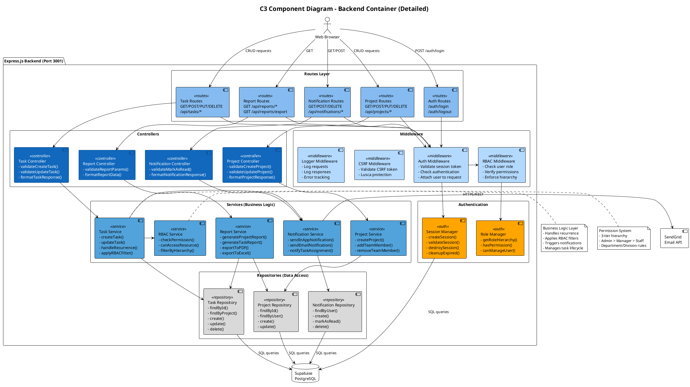
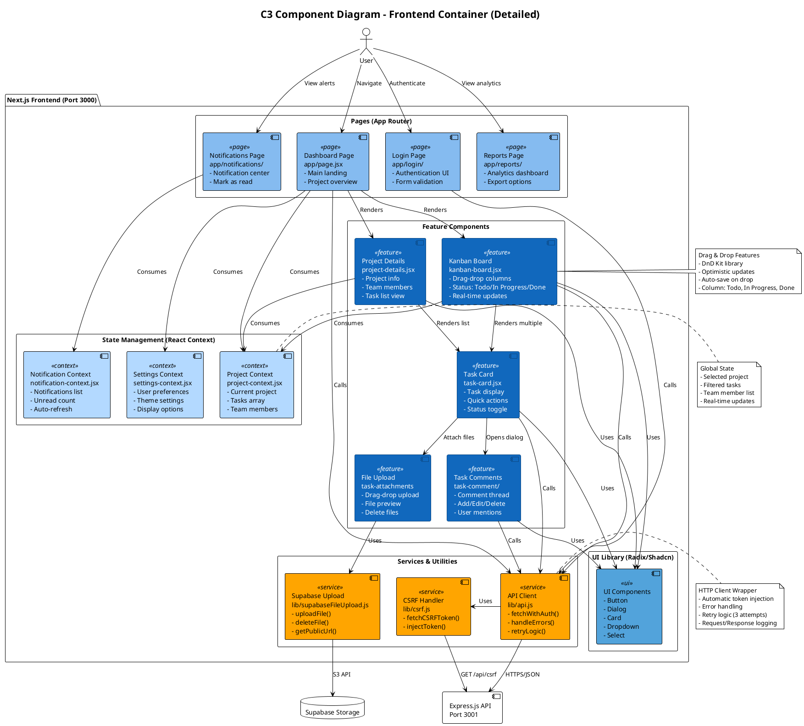
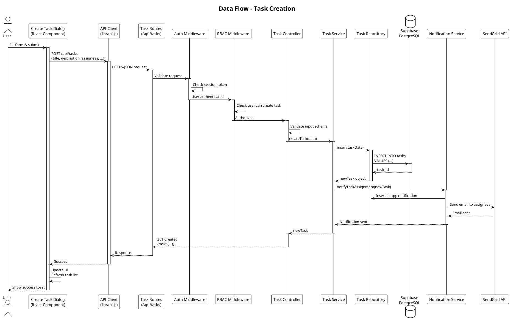
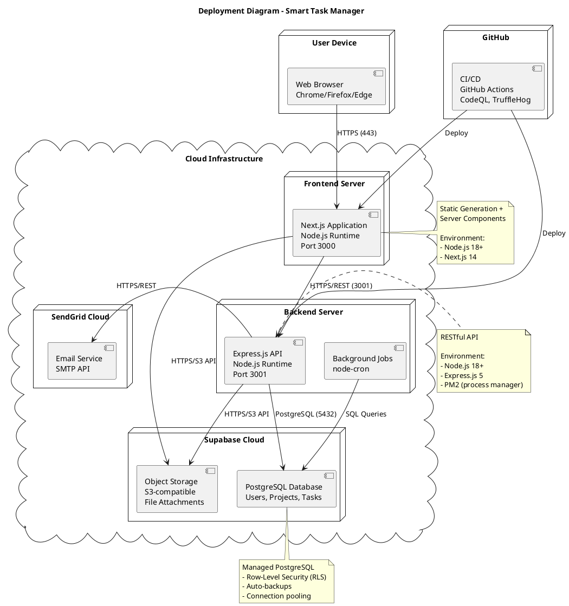

# C3 Component Diagram - Smart Task Manager (PlantUML)

This document contains a detailed C3 (Component) diagram using PlantUML syntax, showing the internal structure and component relationships of the Smart Task Manager system.

## Full System Component Diagram

File: `c3-component-full.puml`

```plantuml
@startuml c3-component-full
!define RECTANGLE class

skinparam component {
    BackgroundColor<<frontend>> LightBlue
    BackgroundColor<<backend>> LightGreen
    BackgroundColor<<middleware>> LightYellow
    BackgroundColor<<service>> LightCyan
    BackgroundColor<<repository>> LightGray
    BackgroundColor<<external>> Pink
}

title C3 Component Diagram - Smart Task Manager (Full System)

package "Frontend Container (Next.js - Port 3000)" {

    package "UI Layer" {
        component [Pages/Routes\nApp Router] as Pages <<frontend>>
        component [UI Components\nKanban, Tasks, Projects] as Components <<frontend>>
        component [UI Library\nRadix/Shadcn] as UILib <<frontend>>
    }

    package "State Management" {
        component [Project Context\nproject-context.jsx] as ProjectCtx <<frontend>>
        component [Notification Context\nnotification-context.jsx] as NotifCtx <<frontend>>
        component [Settings Context\nsettings-context.jsx] as SettingsCtx <<frontend>>
    }

    package "Frontend Services" {
        component [API Client\nlib/api.js] as APIClient <<frontend>>
        component [CSRF Handler\nlib/csrf.js] as CSRFHandler <<frontend>>
        component [File Upload\nSupabase Storage] as FileUpload <<frontend>>
    }
}

package "Backend Container (Express.js - Port 3001)" {

    package "Routes Layer" {
        component [Auth Routes\n/auth/*] as AuthRoutes <<backend>>
        component [Task Routes\n/api/tasks/*] as TaskRoutes <<backend>>
        component [Project Routes\n/api/projects/*] as ProjectRoutes <<backend>>
        component [User Routes\n/api/users/*] as UserRoutes <<backend>>
        component [Notification Routes\n/api/notifications/*] as NotifRoutes <<backend>>
        component [Report Routes\n/api/reports/*] as ReportRoutes <<backend>>
        component [Comment Routes\n/api/tasks/:id/comments] as CommentRoutes <<backend>>
        component [Attachment Routes\n/api/tasks/:id/attachments] as AttachRoutes <<backend>>
    }

    package "Middleware Layer" {
        component [Auth Middleware\nSession Validation] as AuthMW <<middleware>>
        component [RBAC Middleware\nPermission Checks] as RBACMW <<middleware>>
        component [Logger Middleware\nRequest/Response Logs] as LoggerMW <<middleware>>
        component [CSRF Protection\nLusca] as CSRFMW <<middleware>>
    }

    package "Controller Layer" {
        component [Task Controller\nRequest Handlers] as TaskCtrl <<backend>>
        component [Project Controller\nRequest Handlers] as ProjectCtrl <<backend>>
        component [User Controller\nRequest Handlers] as UserCtrl <<backend>>
        component [Notification Controller\nRequest Handlers] as NotifCtrl <<backend>>
        component [Report Controller\nRequest Handlers] as ReportCtrl <<backend>>
        component [Comment Controller\nRequest Handlers] as CommentCtrl <<backend>>
        component [Attachment Controller\nRequest Handlers] as AttachCtrl <<backend>>
    }

    package "Service Layer (Business Logic)" {
        component [Task Service\nTask Operations, Recurrence] as TaskSvc <<service>>
        component [Project Service\nProject Management] as ProjectSvc <<service>>
        component [User Service\nUser Management] as UserSvc <<service>>
        component [Notification Service\nIn-app & Email Alerts] as NotifSvc <<service>>
        component [Report Service\nAnalytics & Export] as ReportSvc <<service>>
        component [Comment Service\nComment Operations] as CommentSvc <<service>>
        component [Attachment Service\nFile Management] as AttachSvc <<service>>
        component [Assignee Hours Service\nTime Tracking] as AssigneeSvc <<service>>
        component [RBAC Service\nPermission Logic] as RBACSvc <<service>>
    }

    package "Repository Layer (Data Access)" {
        component [Task Repository\nDB Queries] as TaskRepo <<repository>>
        component [Project Repository\nDB Queries] as ProjectRepo <<repository>>
        component [User Repository\nDB Queries] as UserRepo <<repository>>
        component [Notification Repository\nDB Queries] as NotifRepo <<repository>>
        component [Comment Repository\nDB Queries] as CommentRepo <<repository>>
        component [Attachment Repository\nDB Queries] as AttachRepo <<repository>>
    }

    package "Authentication" {
        component [Session Manager\nCreate/Validate Sessions] as SessionMgr <<service>>
        component [Role Manager\nRole Hierarchy] as RoleMgr <<service>>
    }

    package "Background Jobs" {
        component [Cron Job\nCheck Overdue Tasks] as CronJob <<service>>
    }
}

database "Supabase PostgreSQL\nDatabase" as Database <<external>>
component [SendGrid\nEmail Service] as EmailService <<external>>
database "Supabase Storage\nFile Storage" as Storage <<external>>

' Frontend internal connections
Pages --> Components
Components --> UILib
Components --> ProjectCtx
Components --> NotifCtx
Components --> SettingsCtx
Pages --> APIClient
APIClient --> CSRFHandler
Components --> FileUpload

' Frontend to Backend connections
APIClient --> AuthRoutes : HTTPS/JSON
APIClient --> TaskRoutes : HTTPS/JSON
APIClient --> ProjectRoutes : HTTPS/JSON
APIClient --> UserRoutes : HTTPS/JSON
APIClient --> NotifRoutes : HTTPS/JSON
APIClient --> ReportRoutes : HTTPS/JSON
APIClient --> CommentRoutes : HTTPS/JSON
APIClient --> AttachRoutes : HTTPS/JSON

' Routes to Middleware
AuthRoutes --> AuthMW
TaskRoutes --> AuthMW
ProjectRoutes --> AuthMW
UserRoutes --> AuthMW
NotifRoutes --> AuthMW
ReportRoutes --> AuthMW
CommentRoutes --> AuthMW
AttachRoutes --> AuthMW

' Middleware connections
AuthMW --> RBACMW
AuthMW --> SessionMgr
RBACMW --> RoleMgr

' Routes to Controllers
TaskRoutes --> TaskCtrl
ProjectRoutes --> ProjectCtrl
UserRoutes --> UserCtrl
NotifRoutes --> NotifCtrl
ReportRoutes --> ReportCtrl
CommentRoutes --> CommentCtrl
AttachRoutes --> AttachCtrl

' Controllers to Services
TaskCtrl --> TaskSvc
ProjectCtrl --> ProjectSvc
UserCtrl --> UserSvc
NotifCtrl --> NotifSvc
ReportCtrl --> ReportSvc
CommentCtrl --> CommentSvc
AttachCtrl --> AttachSvc

' Service layer connections
TaskSvc --> TaskRepo
TaskSvc --> NotifSvc
TaskSvc --> RBACSvc
TaskSvc --> AssigneeSvc
ProjectSvc --> ProjectRepo
UserSvc --> UserRepo
NotifSvc --> NotifRepo
CommentSvc --> CommentRepo
AttachSvc --> AttachRepo

' Repository to Database
TaskRepo --> Database : SQL
ProjectRepo --> Database : SQL
UserRepo --> Database : SQL
NotifRepo --> Database : SQL
CommentRepo --> Database : SQL
AttachRepo --> Database : SQL
SessionMgr --> Database : SQL

' External service connections
NotifSvc --> EmailService : HTTPS/REST
FileUpload --> Storage : S3 API
AttachSvc --> Storage : S3 API

' Background jobs
CronJob --> TaskSvc
CronJob --> NotifSvc

@enduml
```



## Backend Components Only (Detailed View)

File: `c3-component-backend-detailed.puml`



## Frontend Components Only (Detailed View)

File: `c3-component-frontend-detailed.puml`



## Data Flow Diagrams

File: `c3-dataflow-task-creation.puml`



## Deployment Diagram

File: `c3-deployment.puml`



## How to Use

### Rendering Options

1. **Online PlantUML Editor**
   - Visit: http://www.plantuml.com/plantuml/uml/
   - Paste diagram code
   - View rendered image

2. **VS Code Extension**
   ```bash
   # Install extension
   code --install-extension jebbs.plantuml
   ```
   - Create `.puml` files
   - Press `Alt+D` to preview

3. **Command Line**
   ```bash
   # Install PlantUML
   npm install -g node-plantuml

   # Generate diagrams
   puml generate c3-component-full.puml -o ./output/
   ```

4. **IntelliJ IDEA / WebStorm**
   - Install "PlantUML integration" plugin
   - Right-click `.puml` file → "Show PlantUML Diagram"

### Recommended File Structure

```
diagrams/
├── plantuml/
│   ├── c3-component-full.puml
│   ├── c3-component-backend-detailed.puml
│   ├── c3-component-frontend-detailed.puml
│   ├── c3-dataflow-task-creation.puml
│   └── c3-deployment.puml
└── output/
    ├── c3-component-full.png
    ├── c3-component-backend-detailed.png
    └── ...
```

## Color Legend

| Color | Component Type |
|-------|---------------|
| Light Blue (#85BBF0) | Pages/Routes |
| Dark Blue (#1168BD) | Controllers/Feature Components |
| Cyan (#52A3DB) | Services/UI Library |
| Light Yellow (#B3D9FF) | Middleware/Context |
| Light Gray (#D9D9D9) | Repositories |
| Orange (#FFA500) | Authentication/Utilities |
| Pink | External Systems |
