# C3 Component Diagram - Smart Task Manager

## System Overview
This diagram shows the internal components of the Smart Task Manager application and how they interact with each other.

## Component Diagram

```mermaid
graph TB
    subgraph "Frontend Container (Next.js - Port 3000)"
        subgraph "UI Layer"
            Pages[Pages/Routes<br/>App Router]
            Components[UI Components<br/>Kanban, Tasks, Projects]
            UILib[UI Library<br/>Radix/Shadcn]
        end

        subgraph "State Management"
            ProjectCtx[Project Context]
            NotifCtx[Notification Context]
            SettingsCtx[Settings Context]
        end

        subgraph "Frontend Services"
            APIClient[API Client<br/>lib/api.js]
            CSRFHandler[CSRF Handler<br/>lib/csrf.js]
            FileUpload[File Upload<br/>Supabase Storage]
        end

        Pages --> Components
        Components --> UILib
        Components --> ProjectCtx
        Components --> NotifCtx
        Components --> SettingsCtx
        Pages --> APIClient
        APIClient --> CSRFHandler
        Components --> FileUpload
    end

    subgraph "Backend Container (Express.js - Port 3001)"
        subgraph "Routes Layer"
            AuthRoutes[Auth Routes<br/>/auth/*]
            TaskRoutes[Task Routes<br/>/api/tasks/*]
            ProjectRoutes[Project Routes<br/>/api/projects/*]
            UserRoutes[User Routes<br/>/api/users/*]
            NotifRoutes[Notification Routes<br/>/api/notifications/*]
            ReportRoutes[Report Routes<br/>/api/reports/*]
            CommentRoutes[Comment Routes<br/>/api/tasks/:id/comments]
            AttachRoutes[Attachment Routes<br/>/api/tasks/:id/attachments]
        end

        subgraph "Middleware Layer"
            AuthMiddleware[Auth Middleware<br/>Session Validation]
            RBACMiddleware[RBAC Middleware<br/>Permission Checks]
            LoggerMiddleware[Logger Middleware<br/>Request/Response Logs]
            CSRFMiddleware[CSRF Protection<br/>Lusca]
        end

        subgraph "Controller Layer"
            TaskController[Task Controller<br/>Request Handlers]
            ProjectController[Project Controller<br/>Request Handlers]
            UserController[User Controller<br/>Request Handlers]
            NotifController[Notification Controller<br/>Request Handlers]
            ReportController[Report Controller<br/>Request Handlers]
            CommentController[Comment Controller<br/>Request Handlers]
            AttachController[Attachment Controller<br/>Request Handlers]
        end

        subgraph "Service Layer (Business Logic)"
            TaskService[Task Service<br/>Task Operations, Recurrence]
            ProjectService[Project Service<br/>Project Management]
            UserService[User Service<br/>User Management]
            NotifService[Notification Service<br/>In-app & Email Alerts]
            ReportService[Report Service<br/>Analytics & Export]
            CommentService[Comment Service<br/>Comment Operations]
            AttachService[Attachment Service<br/>File Management]
            AssigneeService[Assignee Hours Service<br/>Time Tracking]
            RBACService[RBAC Service<br/>Permission Logic]
        end

        subgraph "Repository Layer (Data Access)"
            TaskRepo[Task Repository<br/>DB Queries]
            ProjectRepo[Project Repository<br/>DB Queries]
            UserRepo[User Repository<br/>DB Queries]
            NotifRepo[Notification Repository<br/>DB Queries]
            CommentRepo[Comment Repository<br/>DB Queries]
            AttachRepo[Attachment Repository<br/>DB Queries]
        end

        subgraph "Authentication"
            SessionManager[Session Manager<br/>Create/Validate Sessions]
            RoleManager[Role Manager<br/>Role Hierarchy]
        end

        subgraph "Background Jobs"
            CronJob[Cron Job<br/>Check Overdue Tasks]
        end

        AuthRoutes --> AuthMiddleware
        TaskRoutes --> AuthMiddleware
        ProjectRoutes --> AuthMiddleware
        UserRoutes --> AuthMiddleware
        NotifRoutes --> AuthMiddleware
        ReportRoutes --> AuthMiddleware
        CommentRoutes --> AuthMiddleware
        AttachRoutes --> AuthMiddleware

        AuthMiddleware --> RBACMiddleware
        AuthMiddleware --> SessionManager
        RBACMiddleware --> RoleManager

        TaskRoutes --> TaskController
        ProjectRoutes --> ProjectController
        UserRoutes --> UserController
        NotifRoutes --> NotifController
        ReportRoutes --> ReportController
        CommentRoutes --> CommentController
        AttachRoutes --> AttachController

        TaskController --> TaskService
        ProjectController --> ProjectService
        UserController --> UserService
        NotifController --> NotifService
        ReportController --> ReportService
        CommentController --> CommentService
        AttachController --> AttachService

        TaskService --> TaskRepo
        TaskService --> NotifService
        TaskService --> RBACService
        ProjectService --> ProjectRepo
        UserService --> UserRepo
        NotifService --> NotifRepo
        CommentService --> CommentRepo
        AttachService --> AttachRepo
        TaskService --> AssigneeService

        CronJob --> TaskService
        CronJob --> NotifService
    end

    subgraph "External Systems"
        Database[(Supabase PostgreSQL<br/>Database)]
        EmailService[SendGrid<br/>Email Service]
        Storage[Supabase Storage<br/>File Storage]
    end

    APIClient -->|HTTPS REST API| AuthRoutes
    APIClient -->|HTTPS REST API| TaskRoutes
    APIClient -->|HTTPS REST API| ProjectRoutes
    APIClient -->|HTTPS REST API| UserRoutes
    APIClient -->|HTTPS REST API| NotifRoutes
    APIClient -->|HTTPS REST API| ReportRoutes
    APIClient -->|HTTPS REST API| CommentRoutes
    APIClient -->|HTTPS REST API| AttachRoutes

    TaskRepo --> Database
    ProjectRepo --> Database
    UserRepo --> Database
    NotifRepo --> Database
    CommentRepo --> Database
    AttachRepo --> Database
    SessionManager --> Database

    NotifService --> EmailService
    FileUpload --> Storage
    AttachService --> Storage

    style Pages fill:#e1f5ff
    style Components fill:#e1f5ff
    style APIClient fill:#e1f5ff
    style TaskController fill:#ffe1f5
    style ProjectController fill:#ffe1f5
    style UserController fill:#ffe1f5
    style NotifController fill:#ffe1f5
    style TaskService fill:#fff4e1
    style ProjectService fill:#fff4e1
    style UserService fill:#fff4e1
    style NotifService fill:#fff4e1
    style TaskRepo fill:#e1ffe1
    style ProjectRepo fill:#e1ffe1
    style UserRepo fill:#e1ffe1
    style NotifRepo fill:#e1ffe1
    style Database fill:#d4d4d4
    style EmailService fill:#d4d4d4
    style Storage fill:#d4d4d4
```



## Component Responsibilities

### Frontend Components

| Component | Responsibility | Key Files |
|-----------|---------------|-----------|
| **Pages/Routes** | Application routing and page rendering | `app/page.jsx`, `app/login/`, `app/notifications/` |
| **UI Components** | Reusable UI elements and feature components | `kanban-board.jsx`, `task-card.jsx`, `project-details.jsx` |
| **UI Library** | Base UI primitives | `components/ui/*` (Radix/Shadcn) |
| **Project Context** | Project state management | `contexts/project-context.jsx` |
| **Notification Context** | Notification state management | `contexts/notification-context.jsx` |
| **Settings Context** | User settings state | `contexts/settings-context.jsx` |
| **API Client** | HTTP client for backend communication | `lib/api.js` |
| **CSRF Handler** | CSRF token management | `lib/csrf.js` |
| **File Upload** | File upload to Supabase Storage | `lib/supabaseFileUpload.js` |

### Backend Components

#### Routes Layer
| Component | Responsibility | Endpoints |
|-----------|---------------|-----------|
| **Auth Routes** | Authentication endpoints | `/auth/login`, `/auth/logout` |
| **Task Routes** | Task CRUD endpoints | `/api/tasks/*` |
| **Project Routes** | Project CRUD endpoints | `/api/projects/*` |
| **User Routes** | User management endpoints | `/api/users/*` |
| **Notification Routes** | Notification endpoints | `/api/notifications/*` |
| **Report Routes** | Report generation endpoints | `/api/reports/*` |
| **Comment Routes** | Task comment endpoints | `/api/tasks/:id/comments` |
| **Attachment Routes** | File attachment endpoints | `/api/tasks/:id/attachments` |

#### Middleware Layer
| Component | Responsibility | File |
|-----------|---------------|------|
| **Auth Middleware** | Session validation and authentication | `middleware/auth.js` |
| **RBAC Middleware** | Role-based access control enforcement | `middleware/rbac.js` |
| **Logger Middleware** | Request/response logging | `middleware/logger.js` |
| **CSRF Middleware** | CSRF protection | Lusca configuration |

#### Controller Layer
| Component | Responsibility | File |
|-----------|---------------|------|
| **Task Controller** | Task request validation and response formatting | `controllers/taskController.js` |
| **Project Controller** | Project request validation | `controllers/projectController.js` |
| **User Controller** | User request validation | `controllers/userController.js` |
| **Notification Controller** | Notification request validation | `controllers/notificationController.js` |
| **Report Controller** | Report request validation | `controllers/reportController.js` |
| **Comment Controller** | Comment request validation | `controllers/taskCommentController.js` |
| **Attachment Controller** | Attachment request validation | `controllers/taskAttachmentController.js` |

#### Service Layer (Business Logic)
| Component | Responsibility | File |
|-----------|---------------|------|
| **Task Service** | Task operations, recurrence logic, RBAC filtering | `services/taskService.js` |
| **Project Service** | Project management logic | `services/projectService.js` |
| **User Service** | User management logic | `services/userService.js` |
| **Notification Service** | In-app and email notification orchestration | `services/notificationService.js` |
| **Report Service** | Report generation and analytics | `services/reportService.js` |
| **Comment Service** | Comment operations | `services/taskCommentService.js` |
| **Attachment Service** | File attachment management | `services/taskAttachmentService.js` |
| **Assignee Hours Service** | Time tracking logic | `services/taskAssigneeHoursService.js` |
| **RBAC Service** | Permission checking and role hierarchy | `services/rbacService.js` |

#### Repository Layer (Data Access)
| Component | Responsibility | File |
|-----------|---------------|------|
| **Task Repository** | Task database queries | `repository/taskRepository.js` |
| **Project Repository** | Project database queries | `repository/projectRepository.js` |
| **User Repository** | User database queries | `repository/userRepository.js` |
| **Notification Repository** | Notification database queries | `repository/notificationRepository.js` |
| **Comment Repository** | Comment database queries | `repository/taskCommentRepository.js` |
| **Attachment Repository** | Attachment database queries | `repository/taskAttachmentRepository.js` |

#### Authentication Components
| Component | Responsibility | File |
|-----------|---------------|------|
| **Session Manager** | Session creation, validation, cleanup | `auth/sessions.js` |
| **Role Manager** | Role hierarchy and permission definitions | `auth/roles.js` |

#### Background Jobs
| Component | Responsibility | File |
|-----------|---------------|------|
| **Cron Job** | Scheduled check for overdue tasks, sends notifications | `jobs/checkOverdueTasks.js` |

### External Systems
| System | Purpose | Integration |
|--------|---------|-------------|
| **Supabase PostgreSQL** | Primary data storage | PostgreSQL client |
| **SendGrid** | Email notification delivery | SendGrid API |
| **Supabase Storage** | File attachment storage | S3-compatible API |

## Data Flow Examples

### Task Creation Flow
```
User (Browser)
  → UI Component (create-task-dialog.jsx)
  → API Client (lib/api.js)
  → POST /api/tasks
  → Auth Middleware → RBAC Middleware
  → Task Controller (validate input)
  → Task Service (business logic)
  → Task Repository (DB insert)
  → Supabase Database
  → Notification Service (notify assignees)
  → SendGrid (email) + Notification Repository (in-app)
```

### User Login Flow
```
User (Browser)
  → Login Page (app/login/)
  → API Client
  → POST /auth/login
  → Auth Routes
  → Session Manager (validate credentials)
  → User Repository (check user)
  → Database
  → Session Manager (create session)
  → Response with session token
```

### File Upload Flow
```
User (Browser)
  → File Upload Component
  → Supabase File Upload (lib/supabaseFileUpload.js)
  → Supabase Storage
  → API Client
  → POST /api/tasks/:id/attachments
  → Attachment Controller
  → Attachment Service
  → Attachment Repository
  → Database (save file metadata)
```

## Key Patterns

1. **Layered Architecture**: Clear separation between Routes → Controllers → Services → Repositories
2. **Middleware Chain**: Authentication → Authorization → Business Logic
3. **Context-Based State**: React Context API for frontend state management
4. **Repository Pattern**: Abstraction of data access logic
5. **Service Orchestration**: Services coordinate between multiple repositories and external systems
6. **Event-Driven**: Background jobs trigger notifications based on task deadlines

## Technology Stack per Layer

| Layer | Technologies |
|-------|-------------|
| **Frontend UI** | Next.js 14, React 18, Tailwind CSS, Radix UI |
| **Frontend State** | React Context API, react-hook-form |
| **API Communication** | Fetch API, CSRF tokens |
| **Backend Framework** | Express.js 5, Node.js 18+ |
| **Authentication** | JWT, bcryptjs, custom sessions |
| **Authorization** | Custom RBAC middleware |
| **Data Access** | PostgreSQL (via Supabase client) |
| **Background Jobs** | node-cron |
| **External Services** | SendGrid (email), Supabase Storage (files) |
