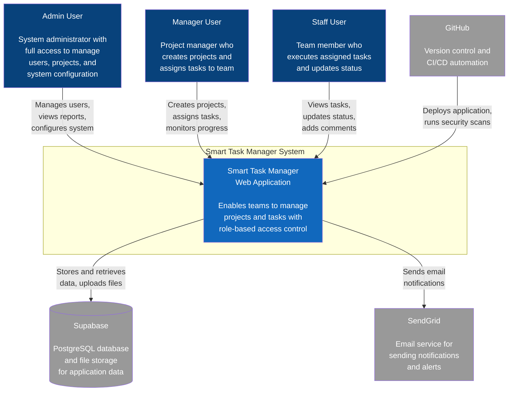
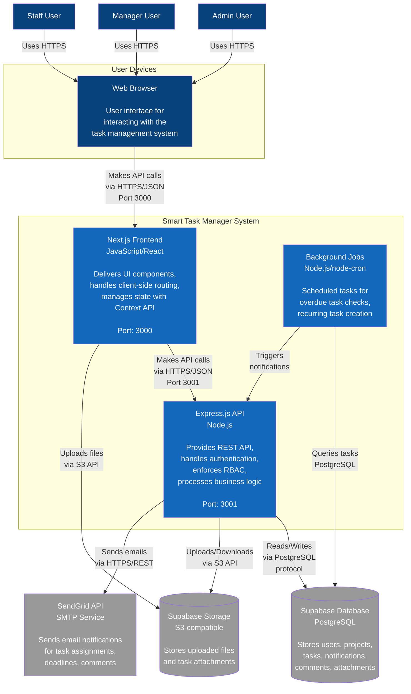
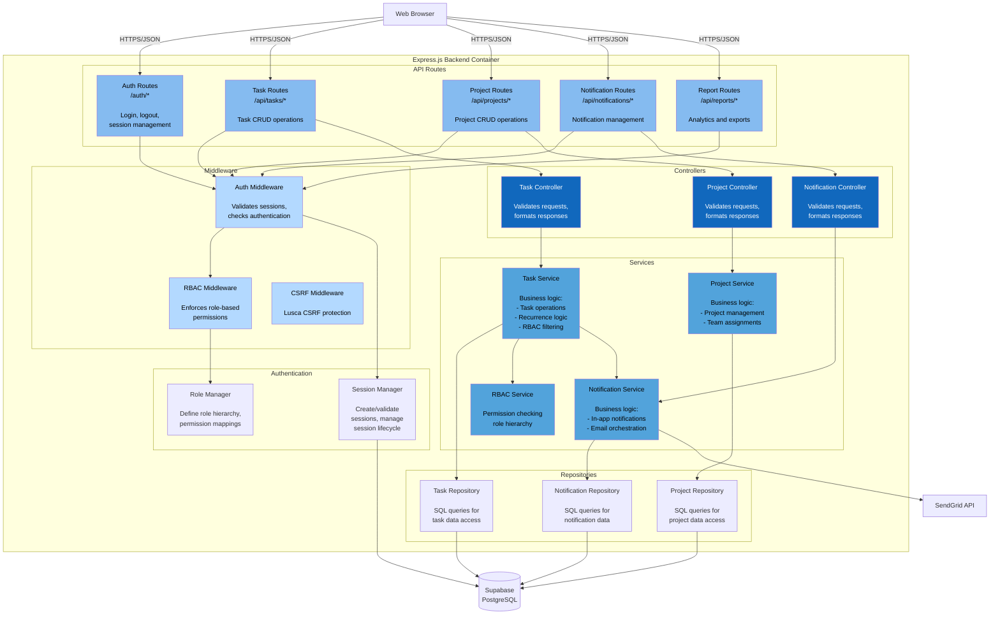
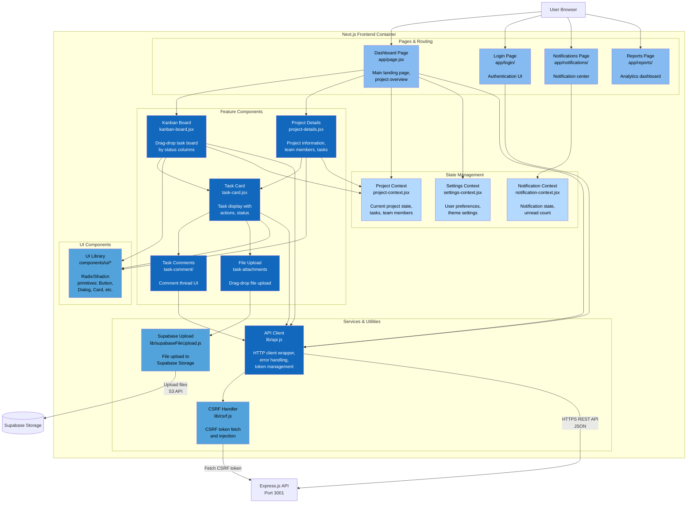

# C4 Architecture Diagrams - Smart Task Manager (Mermaid)

This document contains C4 architecture diagrams using Mermaid syntax.

## Level 1: System Context Diagram

Shows the big picture - how the Smart Task Manager fits into the world.



## Level 2: Container Diagram

Shows the high-level technology choices and how containers communicate.



## Level 3: Component Diagram - Backend API

Shows the components inside the Express.js Backend container.



## Level 3: Component Diagram - Frontend Application

Shows the components inside the Next.js Frontend container.



## Key Relationships

### Authentication Flow
```
User → Login Page → API Client → Auth Routes → Auth Middleware → Session Manager → Database
```

### Task Creation Flow
```
User → Kanban Board → API Client → Task Routes → RBAC Middleware → Task Controller → Task Service → Task Repository → Database
```

### Notification Flow
```
Cron Job → Task Service → Notification Service → SendGrid API (Email) + Notification Repository (In-app)
```

### File Upload Flow
```
User → File Upload Component → Supabase Upload → Supabase Storage
File metadata → API Client → Attachment Routes → Attachment Service → Database
```

## Technology Summary

| Level | Components | Technologies |
|-------|-----------|--------------|
| **Context** | Entire System | Web Application |
| **Container** | Frontend | Next.js 14, React 18, Tailwind CSS |
| **Container** | Backend API | Express.js 5, Node.js 18+ |
| **Container** | Database | PostgreSQL (Supabase) |
| **Container** | File Storage | S3-compatible (Supabase) |
| **Component** | Routes | Express Router |
| **Component** | Middleware | Custom + Lusca (CSRF) |
| **Component** | Controllers | JavaScript classes |
| **Component** | Services | Business logic modules |
| **Component** | Repositories | SQL query modules |
| **Component** | UI Components | React functional components |
| **Component** | State | React Context API |
